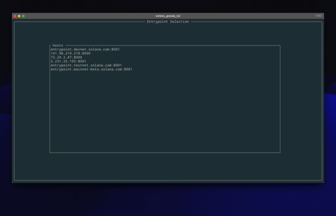

# SOLANA Goggip TUI
[](#license)
[](https://www.rust-lang.org)
[](https://github.com/ceppelli/solana-gossip-tui/actions/workflows/rust.yml)
[](https://codecov.io/gh/ceppelli/solana-gossip-tui)


### TUI client for the Solana Gossip Service implemented in Rust

An attempt to reverse engineer the Solana Gossip protocol.



## ⚠️ This project is still under fluid development and must be considered as alpha version ⚠️

---

## Forewords

The [Solana Blockchain](https://solana.com) is one of the most popular blockchains in the world. Its success is mainly due to its speed, with approximately 3,400 transactions per second, compared to 15 transactions per second for Ethereum, making Solana one of the fastest blockchain networks currently available.

The Gossip Service is the base-ground of the entire network. Every tenth of a second each network’s Node share signed data objects among themselves in order to manage a cluster.  The validator's services listener configuration, contract information, ledger height and vote are some example of exchanged data.

---

## Motivation

Even though the Solana is a large project, the lack of technical documentation on the protocol specifications as [this issue](https://github.com/solana-foundation/specs/issues/9) on the GitHub Solana Foundation repo shows, is quite disarming.

For this reason, driven by my curiosity, I'm trying to reverse engineer the **Gossip Service Protocol** in order to understand how it work.

---

## Design

The architecture of this attempt is very simple as the diagram depicts. Although the application is multithreaded for obvious reason it tries to use as fewer threads as possible. The communication between threads is done only through message passing  avoiding contention on shared data.

All the protocol business logic is execute inside the **logic_t** thread, where the **udp_recever_t** and **udp_sender_t** threads are responsible only for sending and receiving network packets.
Finally the **main_t** thread takes care of handling the user input and displaying the collected data.


One of the goals is to use the fewest external libraries as possible.

Of the original Solana code, only the one relating to the generation of cryptographic keys and related hash functions is used.

---

## Protocol

| Message            | Status |
| :---               | :---:  |
| PullRequest        | ✅ |
| PullResponse       | ✅ |
| PushMessage        | 🔬 |
| PruneMessage       | 🔬 |
| PingMessage        | ✅ |
| PongMessage        | ✅ |


| CrdsData                  | Status |
| :---                      | :---:  |
| LegacyContactInfo         | ✅ |
| Vote                      | ✅ |
| LowestSlot                | ✅ |
| SnapshotHashes            | ✅ |
| AccountsHashes            | ✅ |
| EpochSlots                | ✅ |
| LegacyVersion             | ✅ |
| Version                   | ✅ |
| NodeInstance              | ✅ |
| DuplicateShred            | 🔬 |
| IncrementalSnapshotHashes | ✅ |
| ContactInfo               | 🔬 |


* ✅ - completed
* 📐 - design
* 🔮 - planed
* 🔬 - investigation

---

## Building from Source
solana-gossip-tui is written entirely in Rust and building it from source is dead simple. All you have to do is download source, install rust and build with cargo.

1) Installing rust. Head to [Rust installation](https://www.rust-lang.org/tools/install). It is basically doing
```
curl --proto '=https' --tlsv1.2 -sSf https://sh.rustup.rs | sh
```
2) Get the source code. You can [download from the archives]() or use git clone:
```
git clone https://github.com/ceppelli/solana-gossip-tui.git
```

3) `cd` into source root and do:
```
cargo build --all --release
```

4) The compiled binary is located in `target/release/` directory. Copy the `solana_gossip_tui` binary and place it somewhere where it is easy to run. Preferrably under `$PATH`.

5) solana-gossip-tui is now ready to fire. [Head over to usage](#usage)

---

## Usage

solana-gossip-tui is single binary so it shouldn't be difficult to run.

### Run solana-gossip-tui
```
solana_gossip_tui
```

After the executable has been started the **Entrypoints Selection View** will be displayed.


Select an entrypoint using the `Up/Down` arrow keys and press `Enter` and the **Home View** will be displayed.


## ⚠️ At that moment only the Solana Devnet is answering. We recommend using either the first entrypoint or the IP addresses listed below which are always nodes of the Devnet but less congested. ⚠️


Now press the `c` key and the client will open a local socket on port **8000** and connect to the selected entrypoint.


Pressing the `d` key the communication will be interrupt.

Pressing the `q` key the application will be terminate.

### Show help message
At any time inside the running binary press the `?` key and a contextual help view will be displayed.

--

## Async Client

The **solana_gossip_async** crate implements an async version of the library.

To test it run the **solana-gossip-async** single binary.

### Run solana-gossip-async
```
solana_gossip_async
```

It is also possible to specify the entrypoint address as parameter

### Run solana-gossip-async
```
solana_gossip_async --entrypoint entrypoint.devnet.solana.com:8001
```

The client tries to connect to the Solana Gossip Validator entrypoint and affer the initial handshake has been completed, it will process the incoming messages until the first **pull response legacy contact info** is received.


--

## License

Copyright 2023 Luca Ceppelli

Licensed under the MIT license
<LICENSE-MIT or [https://opensource.org/licenses/MIT](https://opensource.org/licenses/MIT)>. Files in the project may not be
copied, modified, or distributed except according to those terms.